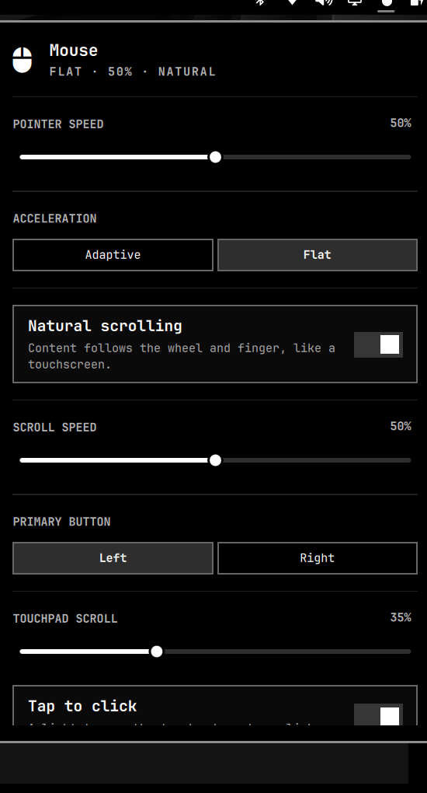

# Mouse

Bar widget for Omarchy pointer settings: speed, acceleration, natural
scrolling, scroll speed, primary button, and common touchpad controls.



## Install

```sh
omarchy plugin add https://github.com/wouldja/omarchy-mouse.git --enable
```

The widget lands on the right of the bar. If it does not appear immediately:

```sh
omarchy-shell shell rescanPlugins
```

Click the mouse icon to open the panel. Scroll the icon to nudge pointer speed.

## Remove

```sh
omarchy plugin remove io.github.wouldja.mouse
```

Removal does not delete Hyprland files the panel already wrote. If you want
those gone too:

1. Delete `~/.config/hypr/mouse.lua`
2. Remove the `require("hypr.mouse")` line from `~/.config/hypr/hyprland.lua`

## What it changes

Using a control in the panel applies the value immediately through `hyprctl eval`
and, on commit, writes:

- `~/.config/hypr/mouse.lua` — generated pointer settings
- `~/.config/hypr/hyprland.lua` — adds `require("hypr.mouse")` if it is missing
  (the rest of the file is left alone)

It does not edit `/usr/share/omarchy` or request elevated permissions.

## License and dependencies

MIT. See [LICENSE](LICENSE).

Needs Omarchy (Quickshell) and Hyprland. Uses `hyprctl` and Python 3 from the
base system. No extra packages, network calls, or installers.
